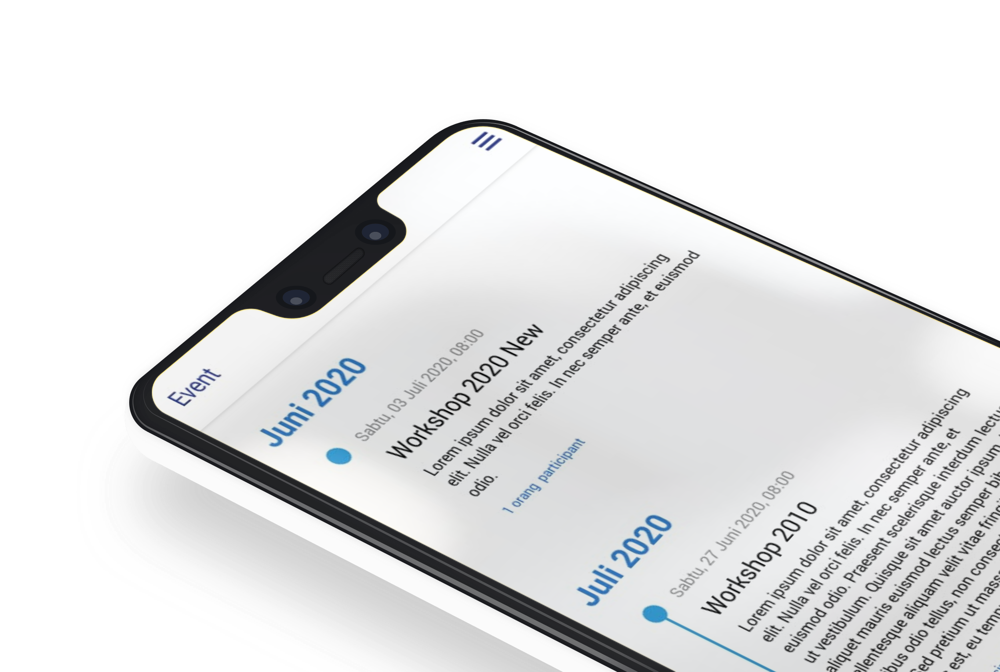

# Socmed Mobile

> Tech Inside

[![React Version][react-image]][react-url]
[![React Native Navigation Versiopn][rnn-image]][rnn-url]

One to two paragraph statement about your product and what it does.



## Installation

```sh
npm install
react-native link
```

## Usage example

```sh
npm install
```

## Development setup

Describe how to install all development dependencies and how to run an automated test-suite of some kind. Potentially do this for multiple platforms.

```sh
react-native run-android
```

## Build setup

Describe how to build all development dependencies and how to run an automated test-suite of some kind. Potentially do this for multiple platforms.

```sh
cd android && ./gradlew assambleRelease
```

or

```sh
cd android && ./gradlew bundleRelease
```

## Meta

Syukri Husaibatul Khairi – syukrihsb148@gmail.com

Distributed under the XYZ license. See `LICENSE` for more information.

<!-- Markdown link & img dfn's -->

[react-image]: https://img.shields.io/badge/React%20Native-0.62.2-blue
[react-url]: https://reactnative.dev/docs/getting-started
[rnn-image]: https://img.shields.io/travis/dbader/node-datadog-metrics/master.svg?style=flat-square
[rnn-url]: https://travis-ci.org/dbader/node-datadog-metrics
[wiki]: https://github.com/yourname/yourproject/wiki
